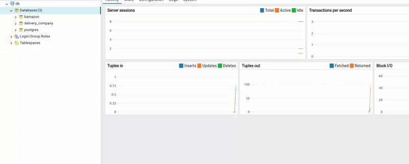
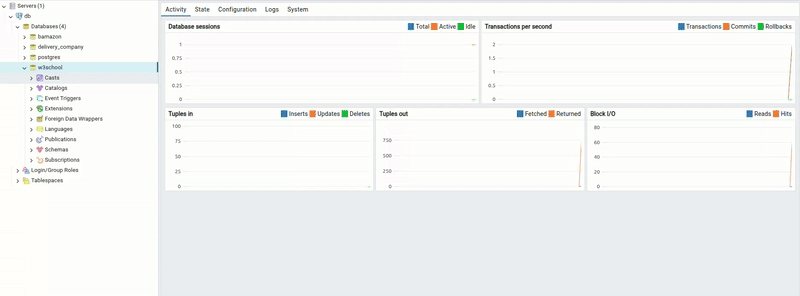

# W3Schools Database

I'm not associated with W3Schools but I have to give them a big shout-out. This is their website:
https://www.w3schools.com

They provide excellent tutorials on the topic of web development. More than 15 years ago in the early 2000s when I was barely a teenager, I discovered their site and that's when I became interested in web development and started learning things little by little.

Anyway this repository contains the database they use for their SQL tutorial here:
https://www.w3schools.com/sql/default.asp

You can see the database tables and the data on the right hand side if you run this example:
https://www.w3schools.com/sql/trysql.asp?filename=trysql_select_all

However, there is nowhere a link to download the database so I decided to create a SQL code for it which I hope you'll find useful because it is nice to have this database locally where you can perform all sorts of SQL queries, tests, for practicing and learning purposes etc. Enjoy!

When the SQL file is executed it creates database named **w3schools** with the following tables

    categories
    customers
    employees
    orders
    order_details
    products
    shippers
    suppliers

and inserts the respective data.

You can change the database name if you want by modifying these 2 lines of code

    CREATE DATABASE IF NOT EXISTS `w3schools`
    USE `w3schools`;

---

### Installation for PostgreSQL

#### 1. Create a database called "w3school"

## 

#### 2. Insert SQL codes

Copy the SQL code from the file, paste it into the query box, and then execute it.

## 

---

#### Note:

CategoryID, CustomerID, EmployeesID, OrderDetailsID, OrderID, ProductID, ShipperID, SupplierID ---> just ID.

### Example:

```sql

CREATE TABLE customers (
  ID int NOT NULL, -- Not CustomerID.
  CustomerName varchar(255) DEFAULT NULL,
  ContactName varchar(255) DEFAULT NULL,
  Address varchar(255) DEFAULT NULL,
  City varchar(255) DEFAULT NULL,
  PostalCode varchar(255) DEFAULT NULL,
  Country varchar(255) DEFAULT NULL,
  CONSTRAINT customers_pk PRIMARY KEY (ID)
) ;

```
